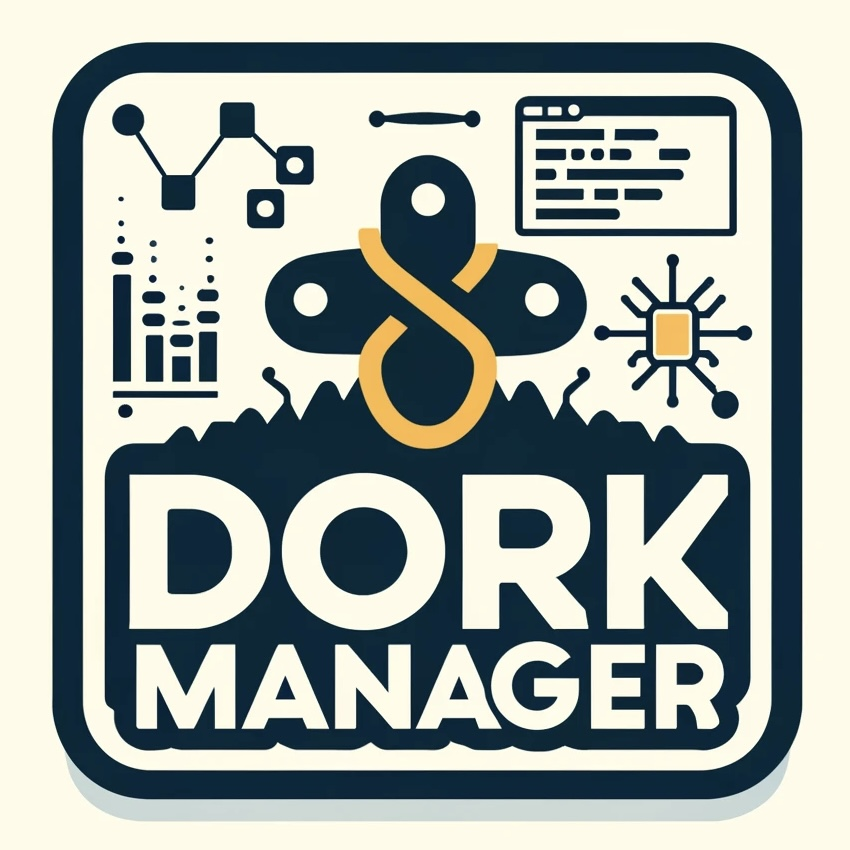

# Dork Manager



[](https://github.com/harryprayiv/DorkManager/actions/workflows/haskell.yml)

## Overview

Dork Manager is a Haskell-based tool designed to scan directories specified in a configuration file and generate a delimited JSON file where each movie is represented as a separate JSON object on a new line. This tool helps maintain and manage a large movie library by identifying and reporting incorrectly formatted `.nfo` files.

## Features

- **Directory Scanning**: Automatically scans directories listed in `config.txt` for `.nfo` files.
- **JSON Generation**: Creates a delimited JSON file with each movie in its own JSON object.
- **Error Reporting**: Identifies and reports `.nfo` files that are incorrectly formatted.
- **Extensible**: Future plans to expand functionality to integrate with PostgreSQL for advanced library management.

## Getting Started

### Prerequisites

- Haskell
- Nix (for using Nix Flakes)

### Installation

1. **Clone the repository**:
    ```bash
    git clone https://github.com/yourusername/dork-manager.git
    cd dork-manager
    ```

2. **Set up environment** (using Nix):
    ```bash
    nix develop
    ```

3. **Build the project**:
    ```bash
    cabal build
    ```

### Usage

1. **Configure directories**:
    - List all the directories to be scanned in a file named `config.txt`, with each directory path on a new line.

2. **Run the tool**:
    ```bash
    cabal run parseMovie -- -c config.txt
    ```

3. **Output**:
    - The tool will generate a `library.ndjson` file in the `dork_library` directory containing the JSON representations of the movies.
    - If any `.nfo` files are incorrectly formatted, they will be reported in `unNamed.ndjson`.

## Contributing

Though this is a very specific project geared toward my strange way of naming files, I sincerely welcome contributions! Feel free to fork the repository, improve the code, create pull requests, report bugs, or request new features.  Perhaps you could create a templating system so any style of file formatting can be considered by this scraper.

### Steps to Contribute

1. **Fork the repository**.
2. **Create a new branch** for your feature or bug fix.
3. **Make your changes**.
4. **Submit a pull request**.

## License

This project is licensed under the MIT License. See the `LICENSE` file for more details.

---

Made with ❤️ by Harry Pray IV.
